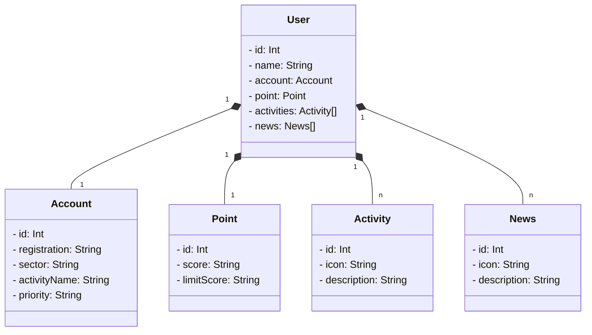

### API REST para concluir o desafio do bootcamp Santander Wek BackEnd Java pela DIO 2023

```mermaid
classDiagram
  class User {
    - id: Int
    - name: String
    - account: Account
    - point: Point
    - activities: Activity[]
    - news: News[]
  }

  class Account {
    - id: Int
    - registration: String
    - sector: String
    - activityName: String
    - priority: String
  }

  class Point {
    - id: Int
    - score: String
    - limitScore: String
  }

  class Activity {
    - id: Int
    - icon: String
    - description: String
  }

  class News {
    - id: Int
    - icon: String
    - description: String
  }

  User "1" *-- "1" Account
  User "1" *-- "1" Point
  User "1" *-- "n" Activity
  User "1" *-- "n" News

```
